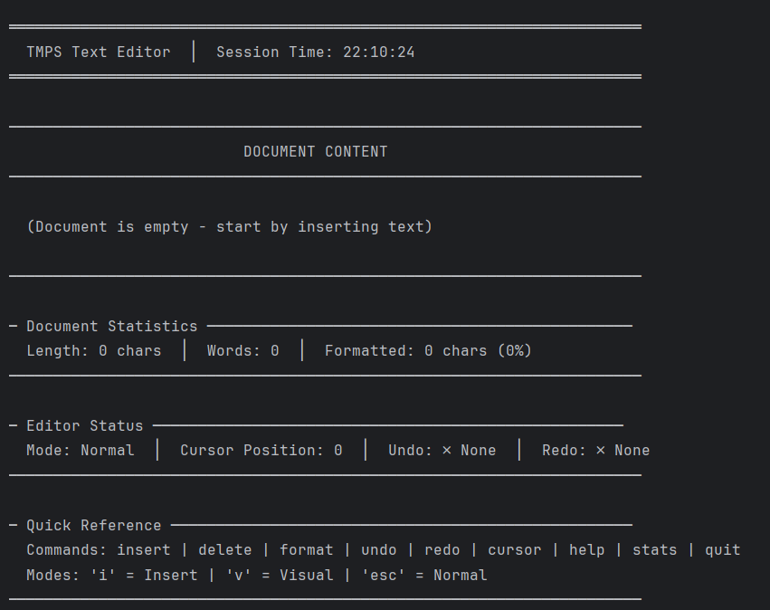

# Laboratory Work 4 - Behavioral Design Patterns

Course: Software Engineering and Design
Author: Mihalevschi Alexandra

## Theory: Behavioral Design Patterns

### Overview

Behavioral design patterns are concerned with algorithms and the assignment of responsibilities between objects. They describe not just patterns of objects or classes but also the patterns of communication between them. These patterns characterize complex control flow that's difficult to follow at run-time.

Unlike creational patterns (which deal with object creation) and structural patterns (which deal with object composition), behavioral patterns focus on **how objects interact and communicate** with each other. They help define the communication patterns between objects and increase flexibility in carrying out this communication.

### Characteristics of Behavioral Patterns

Behavioral design patterns share several key characteristics:

1. **Communication Focus**: They define how objects communicate and distribute responsibilities
2. **Algorithm Encapsulation**: They encapsulate algorithms and behaviors that can vary
3. **Inter-object Relationships**: They establish relationships and communication protocols between objects
4. **Control Flow Management**: They manage complex control flows and state-dependent behaviors
5. **Runtime Flexibility**: They allow behavior to be determined at runtime rather than compile time

### Classification of Behavioral Patterns

Behavioral patterns can be classified into several categories:

- **Chain of Responsibility**: Pass requests along a chain of handlers
- **Command**: Encapsulate requests as objects
- **Interpreter**: Define a grammar and interpreter for language processing
- **Iterator**: Provide a way to access elements of a collection sequentially
- **Mediator**: Define how objects interact with each other through a mediator
- **Memento**: Capture and restore object state
- **Observer**: Define one-to-many dependency between objects
- **State**: Allow object behavior to change based on internal state
- **Strategy**: Define a family of algorithms and make them interchangeable
- **Template Method**: Define skeleton of algorithm in base class
- **Visitor**: Represent operations to be performed on elements of an object structure

### Objectives

The main objectives of behavioral design patterns include:

1. **Encapsulation of Behavior**: Encapsulate algorithms and behaviors that vary, making them interchangeable
2. **Loose Coupling**: Reduce dependencies between objects by defining how they interact
3. **Flexibility**: Allow objects to communicate in flexible ways without tight coupling
4. **Reusability**: Enable reuse of communication patterns across different contexts
5. **Extensibility**: Make it easy to add new behaviors or modify existing ones without changing core structure
6. **Separation of Concerns**: Separate the algorithm from the object that uses it
7. **Dynamic Behavior**: Allow behavior to be determined at runtime

### Patterns Studied

#### 1. Command Pattern

**Theory**: The Command Pattern encapsulates a request as an object, thereby allowing you to parameterize clients with different requests, queue requests, and support undoable operations. This pattern turns a request into a stand-alone object that contains all information about the request, including the method call, the method's arguments, and the object that owns the method.

**Intent**:

- Encapsulate a request as an object
- Parameterize clients with different requests
- Queue operations
- Support undoable operations
- Log requests
- Support macro operations (commands that execute other commands)

**Key Components**:

- **Command Interface**: Declares an interface for executing operations (typically includes `execute()`, `undo()`, and optionally `redo()` methods)
- **ConcreteCommand**:
  - Implements the Command interface
  - Defines a binding between a Receiver object and an action
  - Stores the parameters needed to invoke the receiver's method
  - Invokes the receiver's method when `execute()` is called
- **Invoker**:
  - Asks the command to carry out the request
  - Holds a reference to a command object
  - Can store commands in a queue or history
- **Receiver**:
  - Knows how to perform the operations associated with a request
  - Contains the actual business logic
  - Any class can act as a receiver

#### 2. Observer Pattern

**Theory**: The Observer Pattern defines a one-to-many dependency between objects so that when one object changes state, all its dependents are notified and updated automatically. This pattern is also known as the Publish-Subscribe pattern, where the subject (publisher) notifies observers (subscribers) about state changes.

**Intent**:

- Define a one-to-many dependency between objects
- When one object changes state, all dependent objects are notified automatically
- Maintain consistency between related objects without making them tightly coupled

**Key Components**:

- **Subject (Observable)**:
  - Maintains a list of observers
  - Provides methods to attach, detach, and notify observers
  - Can have any number of observers
  - Doesn't know the concrete class of any observer
- **Observer Interface**:
  - Defines an interface for objects that should be notified of changes
  - Typically includes an `update()` method
  - May include methods for different types of notifications
- **ConcreteObserver**:
  - Implements the Observer interface
  - Maintains a reference to the Subject (for state queries)
  - Stores state that should stay consistent with the subject's state
  - Implements the update operation to keep its state consistent with the subject's

#### 3. State Pattern

**Theory**: The State Pattern allows an object to alter its behavior when its internal state changes. The object will appear to change its class. This pattern is closely related to the concept of finite state machines, where an object can be in one of several states, and the object's behavior changes based on its current state.

**Intent**:

- Allow an object to alter its behavior when its internal state changes
- Make state-specific behavior explicit
- Encapsulate state-specific behavior in separate classes
- Make state transitions explicit and manageable

**Key Components**:

- **Context**:
  - Maintains an instance of a ConcreteState subclass that defines the current state
  - Delegates state-specific requests to the current ConcreteState object
  - Can pass itself as an argument to the State object handling the operation
- **State Interface**:
  - Defines an interface for encapsulating the behavior associated with a particular state of the Context
  - Declares methods that represent state-specific behavior
  - May include methods for state transitions
- **ConcreteState**:
  - Each subclass implements a behavior associated with a state of the Context
  - Implements state-specific behavior
  - Can transition the Context to another state
  - May store local state (state-specific data)

## Implementation

### Project Structure

```
src/main/kotlin/
├── client/
│   └── TextEditorApp.kt          # Main application entry point
└── domain/
    ├── models/
    │   └── TextDocument.kt        # Document model with formatting
    ├── commands/
    │   ├── Command.kt              # Command interface and history
    │   ├── InsertCommand.kt       # Insert text command
    │   ├── DeleteCommand.kt       # Delete text command
    │   └── FormatCommand.kt       # Format text command
    ├── observers/
    │   └── DocumentObserver.kt    # Observer pattern implementation
    └── states/
        └── EditorState.kt         # State pattern for editor modes
```

### Command Pattern Implementation

**Purpose**: Encapsulate document operations as objects, enabling undo/redo functionality.

**Implementation Details**:

1. **Command Interface** (`Command.kt`):

   - Defines `execute()`, `undo()`, and `redo()` methods
   - All document operations implement this interface

2. **CommandHistory** (`Command.kt`):

   - Manages a stack of executed commands
   - Tracks current position in history for undo/redo operations
   - Provides `canUndo()` and `canRedo()` methods

3. **Concrete Commands**:
   - `InsertCommand`: Encapsulates text insertion with position and text
   - `DeleteCommand`: Encapsulates text deletion with position and length
   - `FormatCommand`: Encapsulates text formatting with position, length, and format type

**Usage Flow**:

- User executes a command → Command is executed and added to history
- User calls `undo` → Last command is undone, index decremented
- User calls `redo` → Next command in history is redone, index incremented

### Observer Pattern Implementation

**Purpose**: Notify multiple components about document changes in real-time.

**Implementation Details**:

1. **DocumentObserver Interface** (`DocumentObserver.kt`):

   - Defines `onDocumentChanged()` and `onCursorMoved()` methods
   - All observers must implement this interface

2. **DocumentSubject** (`DocumentObserver.kt`):

   - Maintains a list of attached observers
   - Provides `attach()` and `detach()` methods
   - Notifies all observers when document state changes

3. **Concrete Observers**:
   - `ConsoleObserver`: Displays document change notifications in the console
   - `StatisticsObserver`: Tracks and displays document statistics (change count, length, formatting)

**Usage Flow**:

- Document changes → `DocumentSubject.notifyDocumentChanged()` is called
- All attached observers receive notification → Each observer updates accordingly
- Observers can be dynamically attached/detached at runtime

### State Pattern Implementation

**Purpose**: Manage different editor modes (Normal, Insert, Visual) with different behaviors.

**Implementation Details**:

1. **EditorState Interface** (`EditorState.kt`):

   - Defines `handleInput()`, `getPrompt()`, and `getHelp()` methods
   - Each state implements different behavior for these methods

2. **EditorContext** (`EditorState.kt`):

   - Maintains reference to current state
   - Provides `setState()` to transition between states
   - Delegates input handling to current state

3. **Concrete States**:
   - `NormalState`: Default mode for navigation and commands (prompt: "NORMAL>")
   - `InsertState`: Text input mode (prompt: "INSERT>")
   - `VisualState`: Text selection mode (prompt: "VISUAL>")

**State Transitions**:

- Normal → Insert: User types 'i'
- Normal → Visual: User types 'v'
- Insert/Visual → Normal: User types 'esc'
- Each state handles input differently and provides context-specific prompts

## Results



## Conclusion

This laboratory work successfully demonstrates the practical application of three fundamental behavioral design patterns:

1. **Command Pattern** provides a robust foundation for undo/redo functionality, making the editor more user-friendly and allowing users to recover from mistakes easily.

2. **Observer Pattern** enables real-time updates and loose coupling between the document model and UI components, making the system more maintainable and extensible.

3. **State Pattern** elegantly manages different editor modes, making the code more organized and easier to extend with new modes in the future.

**Key Learnings**:

- Behavioral patterns focus on communication and responsibility distribution
- Patterns can be effectively combined to solve complex problems
- Proper pattern implementation leads to maintainable, extensible code
- Separation of concerns improves code quality and testability

## Building and Running

### Prerequisites

- **JDK 17 or higher** - Make sure Java is installed and `JAVA_HOME` is set
- **Gradle** - The project includes Gradle wrapper, so you don't need to install Gradle separately

### Step-by-Step Instructions

#### Option 1: Using Gradle Wrapper (Recommended)

**On Windows (PowerShell or CMD):**

1. Open a terminal in the project directory:

   ```powershell
   cd C:\Users\Lenovo\IdeaProjects\TMPS_Labs\TMPS_Lab4
   ```

2. Build the project:

   ```powershell
   .\gradlew.bat build
   ```

3. Run the application:
   ```powershell
   .\gradlew.bat run
   ```

**On Linux/Mac:**

1. Make the wrapper executable (first time only):

   ```bash
   chmod +x gradlew
   ```

2. Build the project:

   ```bash
   ./gradlew build
   ```

3. Run the application:
   ```bash
   ./gradlew run
   ```

#### Option 2: Using IntelliJ IDEA

1. Open the project in IntelliJ IDEA
2. Wait for Gradle to sync (automatic)
3. Navigate to `src/main/kotlin/client/TextEditorApp.kt`
4. Right-click on the `main` function
5. Select "Run 'TextEditorAppKt'"

### Troubleshooting

**Problem: "gradlew.bat not found"**

- Solution: Generate the wrapper by running `gradle wrapper` (if you have Gradle installed), or use IntelliJ IDEA which will generate it automatically.

**Problem: "JAVA_HOME is not set"**

- Solution: Set the `JAVA_HOME` environment variable to your JDK installation path.
  - Windows: `set JAVA_HOME=C:\Program Files\Java\jdk-17`
  - Linux/Mac: `export JAVA_HOME=/usr/lib/jvm/java-17-openjdk`

**Problem: Unicode characters not displaying correctly**

- Solution: Ensure your terminal supports UTF-8 encoding. On Windows, you may need to run `chcp 65001` in CMD before running the application.

## Usage Guide

| Command  | Syntax                              | Description                                  |
| -------- | ----------------------------------- | -------------------------------------------- |
| `insert` | `insert <position> <text>`          | Insert text at position                      |
| `delete` | `delete <position> <length>`        | Delete text from position                    |
| `format` | `format <position> <length> <type>` | Format text (type: `bold`, `italic`, `both`) |
| `undo`   | `undo`                              | Undo last command                            |
| `redo`   | `redo`                              | Redo last undone command                     |
| `cursor` | `cursor <position>`                 | Move cursor to position                      |
| `i`      | `i`                                 | Enter INSERT mode                            |
| `v`      | `v`                                 | Enter VISUAL mode                            |
| `esc`    | `esc`                               | Return to Normal mode                        |
| `help`   | `help` or `h`                       | Show help menu                               |
| `stats`  | `stats`                             | Show document statistics                     |
| `quit`   | `quit` or `q`                       | Exit editor                                  |

### Quick Examples

- `insert 0 Hello` - Insert "Hello" at the beginning
- `delete 0 5` - Delete 5 characters from position 0
- `format 0 5 bold` - Apply bold to first 5 characters
- `undo` / `redo` - Undo/redo operations
